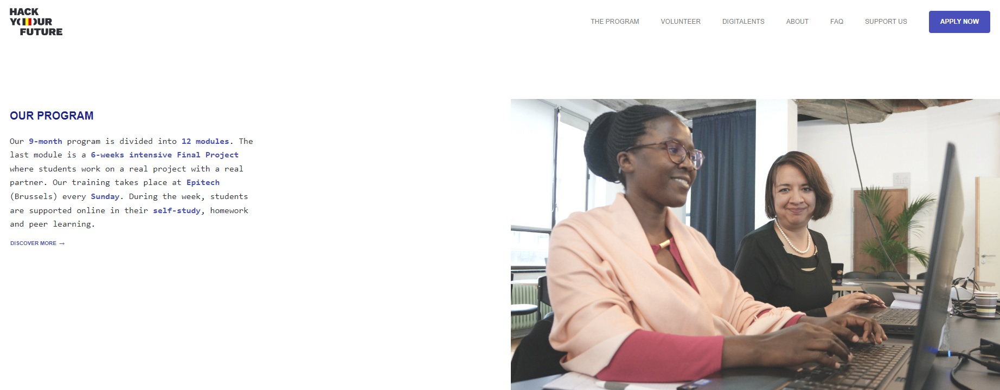

# HYF

> This website is about HYF, a programming course for students with different
> backgrounds. Here the users can navigate thrughout the website to find out
> more information about the courses as well as apply to become a member.

## Table of contents

- [HYF](#hyf)
  - [Table of contents](#table-of-contents)
  - [Screenshots](#screenshots)
  - [Team Members](#team-members)
  - [Technologies](#technologies)
  - [Setup](#setup)
  - [Instructions for use](#instructions-for-use)
  - [Code Quality Checks](#code-quality-checks)
  - [Continuous Integration (CI)](#continuous-integration-ci)
  - [Repo Setup](#repo-setup)

## Screenshots

## Team Members

- [Alex](https://github.com/alex-maletskyi)
- [Juan](https://github.com/jialvaradob)
- [Faisal](https://github.com/faisal-rustamkhel)

## Technologies

- Node 14.16.0
- VSC code
- HTML5 & CSS3

## Setup

- clone the repo
- npm install

## Instructions for use

  
Getting Started

<!-- a guide to using this repository -->

1. `https://github.com/HYF-Class21/agile-development-group4-hyf-redesign`
2. `agile-development-group4-hyf-redesign`
3. `npm install`

## Code Quality Checks

- `npm run format`: Makes sure all the code in this repository is well-formatted
  (looks good).
- `npm run lint:ls`: Checks to make sure all folder and file names match the
  repository conventions.
- `npm run lint:md`: Will lint all of the Markdown files in this repository.
- `npm run lint:css`: Will lint all of the CSS files in this repository.
- `npm run validate:html`: Validates all HTML files in your project.
- `npm run spell-check`: Goes through all the files in this repository looking
  for words it doesn't recognize. Just because it says something is a mistake
  doesn't mean it is! It doesn't know every word in the world. You can add new
  correct words to the [./.cspell.json](./.cspell.json) file so they won't cause
  an error.
- `npm run accessibility -- ./path/to/file.html`: Runs an accessibility analysis
  on all HTML files in the given path and writes the report to
  `/accessibility_report`

## Continuous Integration (CI)

When you open a PR to `main`/`master` in your repository, GitHub will
automatically do a linting check on the code in this repository, you can see
this in the[./.github/workflows/lint.yml](./.github/workflows/lint.yml) file.

If the linting fails, you will not be able to merge the PR. You can double check
that your code will pass before pushing by running the code quality scripts
locally.

## Repo Setup

- Give each member _write_ access to the repo (if it's a group project)
- Turn on GitHub Pages and put a link to your website in the repo's description
- Turn on GitHub Actions
- in the _Branches_ section of your repo's settings make sure:
  - The repository
    [requires a review](https://github.blog/2018-03-23-require-multiple-reviewers/)
    before pull requests can be merged.
  - The `master`/`main` branch must "_Require status checks to pass before
    merging_"
  - The `master`/`main` branch must "_Require require branches to be up to date
    before merging_"

