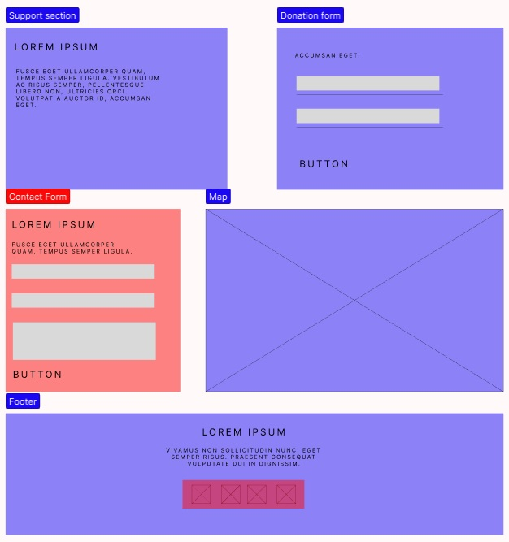
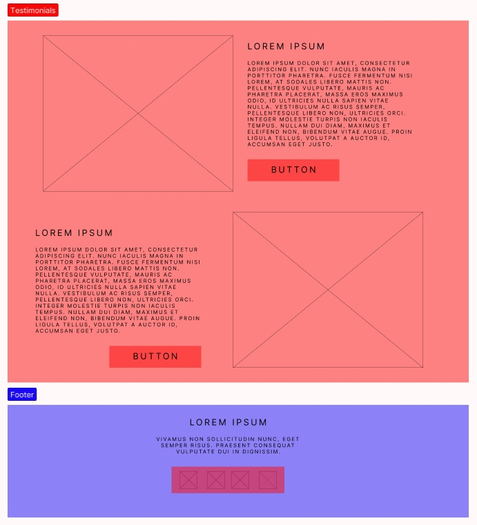

# Design

Below is the wireframe of the website. The wireframes are created for 2 pages:
**Home page**, where it talks about the general information about HYF; and the
**Volunteer page**, in which it explains what it means to volunteer at HYF and
how someone can apply to become a coach.

---

- Red elements - **must-haves**
- Green elements - **should-haves**
- Blue elements - **could-haves**

## Home Page

---

## Volunteer Page

